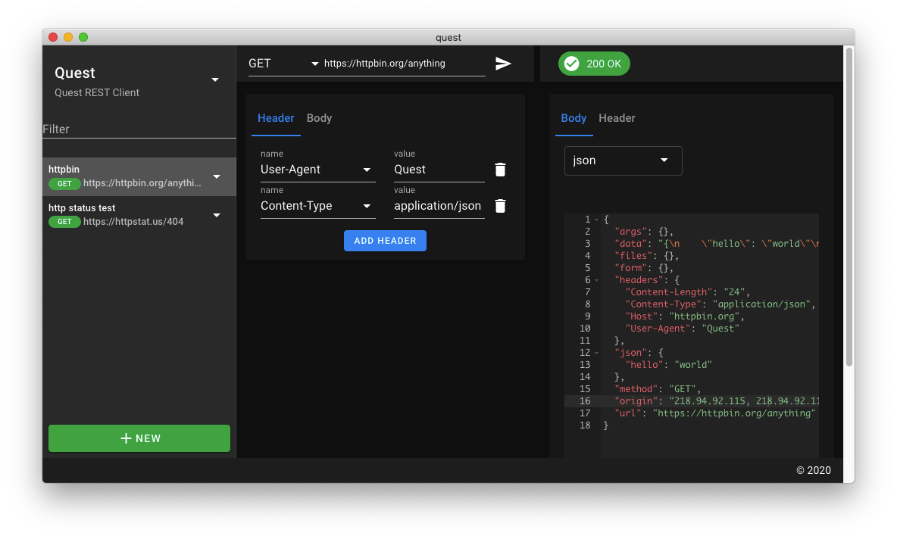
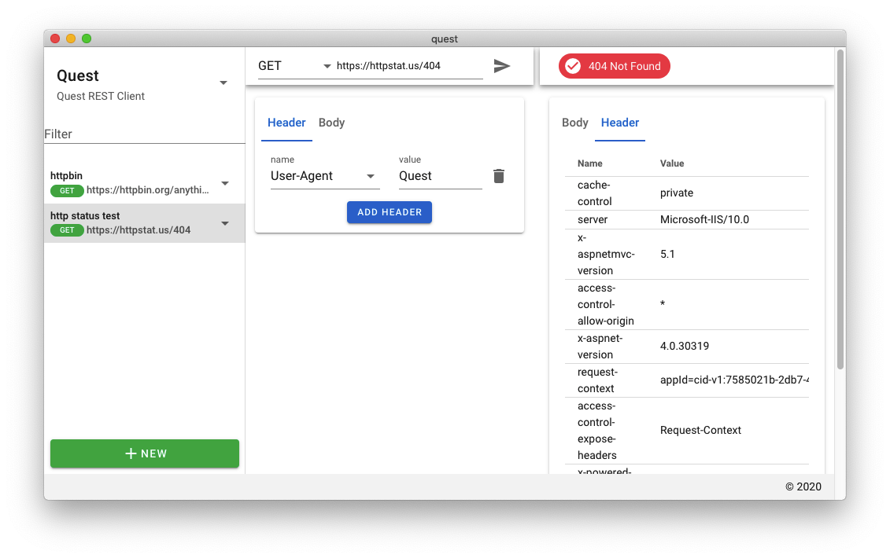

# quest
A very simple postman-like api client using material design. 
It is still in its early stages of development

## features and preview
1. Sending a request using axios supported by httpAdapter from the node.js environment.  No browser-side xhr request limit
2. Dark Mode support
3. Developed using electron, vue.js and axios for easy extension

## Screenshots


## Project setup
```
yarn install
```

### Compiles and hot-reloads for development with electron
```
yarn electron:serve
```

### Compiles and minifies for production
```
yarn electron:build
```

### Lints and fixes files
```
yarn lint
```